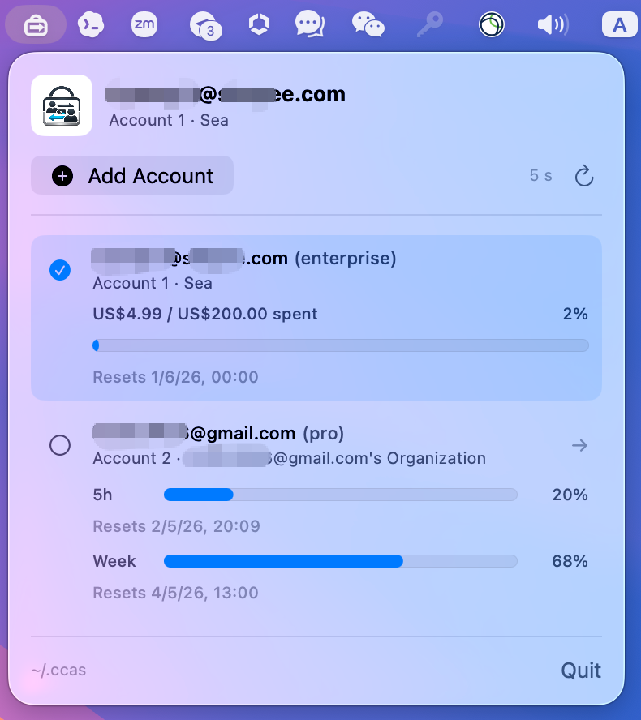

# CCAS

[English](README.md)

CCAS 是 Claude Code Account Switcher 的缩写，是一个原生 macOS 菜单栏应用，用于在多个 Claude Code 账号之间快速切换。

它会常驻在右上角菜单栏。点击图标后，可以添加当前 Claude Code 已登录的账号，也可以从已保存的账号列表中选择目标账号进行切换。

CCAS 与 Anthropic 或 Claude 官方没有关联。

## 截图



## 功能

- 原生 macOS 菜单栏应用。
- 添加当前 Claude Code 已登录账号。
- 按 email、组织名称和账号类型列出已保存账号。
- 显示账号额度信息，帮助你在切换前选择合适账号：
  - Pro 和 Max 账号显示 5 小时、本周两个进度条和重置时间。
  - Team 和 Enterprise 账号显示已用金额、总额度、消耗比例和重置时间。
- 打开菜单时先复用上次获取的额度数据，同时在后台刷新，避免菜单高度先短后高。
- 在菜单栏面板中一键切换账号。
- 中英双语界面：默认英文，系统语言以 `zh` 开头时显示中文。
- 账号元数据保存在 `~/.ccas`。
- 账号凭据保存在 macOS Keychain。
- 提供 Xcode 工程、Swift Package 配置和独立构建脚本。

## 环境要求

- macOS 14 或更高版本。
- 支持 Swift 6 的 Xcode。
- 已安装 Claude Code，并且至少完成过一次登录。

## 构建

### 使用 Xcode

打开工程：

```bash
open CCAS.xcodeproj
```

选择 `CCAS` scheme，在 `My Mac` 上运行。

开发时建议在 `Signing & Capabilities` 中选择 Team。这样应用会有稳定的签名身份，Keychain 的 `Always Allow` 权限更容易保持稳定。使用 ad-hoc 签名时，macOS 可能会在每次重编译后把它当作不同应用，从而反复弹出 Keychain 权限请求。

### 使用脚本

构建独立 app bundle：

```bash
./scripts/build_app.sh
```

运行：

```bash
open dist/CCAS.app
```

构建脚本会从 Xcode 工程读取 `MARKETING_VERSION`、`CURRENT_PROJECT_VERSION` 和 `PRODUCT_BUNDLE_IDENTIFIER`，然后写入最终生成的 app bundle。

## 使用方式

### 添加账号

1. 在 Claude Code 中登录第一个账号。
2. 打开 CCAS 菜单栏面板。
3. 点击 `添加账号`。
4. 在 Claude Code 中切换或重新登录另一个账号。
5. 再次点击 `添加账号`。

如果 CCAS 检测到相同的 email 和组织信息，会更新已有账号的备份，而不是创建重复账号。

### 切换账号

打开 CCAS 菜单栏面板，点击要切换到的账号即可。

切换完成后，请重启 Claude Code，让 Claude Code 重新读取更新后的凭据和配置。

### 查看额度

打开 CCAS 菜单栏面板即可查看已保存账号的额度信息。CCAS 会先显示本地缓存的额度数据，让菜单高度保持稳定；随后在后台获取最新额度，拿到新数据后自动更新界面。

获取额度时，右侧刷新按钮会显示加载动效。`添加账号` 和刷新按钮之间会显示额度数据的最后更新时间，例如 `12 s` 或 `4 m`。

## 工作原理

Claude Code 的登录状态主要保存在两个位置：

- 配置文件，通常是 `~/.claude.json` 或 `~/.claude/.claude.json`。
- macOS Keychain 中 service 为 `Claude Code-credentials` 的项目。

CCAS 会为每个账号保存一份备份：

- 账号索引：`~/.ccas/sequence.json`
- 配置快照：`~/.ccas/configs/`
- 上次获取的额度快照：`~/.ccas/quota-cache.json`
- 已管理账号凭据：macOS Keychain service `li.luy.ccas.accounts`

切换账号时，CCAS 会：

1. 备份当前账号的配置。
2. 从 CCAS 自己的 Keychain service 中读取目标账号凭据。
3. 将目标账号凭据写入 Claude Code 的 `Claude Code-credentials` Keychain 项。
4. 替换 Claude Code 配置文件中的 `oauthAccount` 部分。
5. 更新 `~/.ccas/sequence.json`。

`~/.ccas/configs/` 中的文件只是配置快照，不包含完整 OAuth 凭据。仅靠这些配置文件不能恢复一个账号，因为真正的凭据保存在 Keychain 中。

菜单打开时，CCAS 会先读取 `~/.ccas/quota-cache.json`，立即展示已有额度信息；然后使用每个账号已保存的 Claude OAuth 凭据请求最新额度数据，并在刷新成功后更新缓存。

## 数据与隐私

CCAS 的设计目标是本地优先工具。

- 不上传凭据。
- 不包含遥测。
- 账号元数据和配置快照保存在 `~/.ccas`。
- 缓存的额度数据保存在 `~/.ccas/quota-cache.json`。
- 已管理账号的凭据保存在 macOS Keychain 的 `li.luy.ccas.accounts` service 下。
- 切换账号时会更新 Claude Code 当前使用的 Keychain 项 `Claude Code-credentials`。
- 仅在刷新账号额度时，向 Anthropic 的 usage 接口发起带认证的直接请求。

因为 CCAS 需要读写 Keychain，macOS 可能会请求权限。如果你信任当前构建，并希望减少重复弹窗，可以选择 `Always Allow`。

## 常见问题

### Keychain 权限弹窗反复出现

请在 Xcode 中使用稳定签名：

1. 打开 `CCAS.xcodeproj`。
2. 选择 `CCAS` target。
3. 打开 `Signing & Capabilities`。
4. 选择你的 Team。
5. 重新构建并运行。
6. macOS 请求 Keychain 权限时选择 `Always Allow`。

### 提示账号备份不完整

如果 CCAS 提示某个账号缺少已保存凭据，说明该账号的配置快照存在，但 Keychain 中没有对应的 credential 备份。

修复方式：

1. 在 Claude Code 中重新登录这个账号。
2. 打开 CCAS。
3. 点击 `添加账号`。

CCAS 会更新已有账号的备份。

### 切换后 Claude Code 没有生效

切换账号后请重启 Claude Code。Claude Code 运行期间可能会把凭据缓存在内存中。

## 项目结构

```text
CCAS.xcodeproj/                  Xcode 工程
Package.swift                    Swift Package 配置
Sources/CCASApp/                 应用源码
Sources/CCASApp/Info.plist       App Info.plist 模板
Sources/CCASApp/Resources/       App 图标和菜单栏图标
scripts/build_app.sh             独立 app 构建脚本
```

## 版本发布说明

- 在 Xcode 的 `General > Version` 中维护 `MARKETING_VERSION`。
- 在 Xcode 的 `General > Build` 中维护 `CURRENT_PROJECT_VERSION`。
- `Info.plist` 引用这两个 build setting，Xcode Archive 时会自动展开。
- `build_app.sh` 也会从 Xcode 工程读取这些值，再打包到 `dist/CCAS.app`。

## 许可证

MIT
